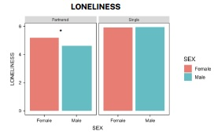
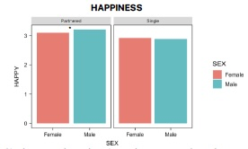

# About Me
Hello there! My name is Jo, and I'm an upcoming graduate from the University of Toronto with a BSc in Psychology

## Education	 			        		
- B.Sc., Psychology | The University of Toronto (_May 2025 (Expected)_)

# Projects
### Gender differences in loneliness in couples and singles

- Prior research has found that women experience unique challenges in relationships compared to men, such as uneven distribution of labour and emotional caretaking (ie. Yan-Liang et al, 2023; Weddel et al., 2022; Steelman, J., 2007)
- Recent discussions online and [in media](https://www.yahoo.com/news/men-carrying-brunt-loneliness-epidemic-122729356.html) have suggested that there is an emerging "male loneliness epidemic", but few studies have investigated this idea
- These ideas inspired me to investigate whether gender differences in loneliness exist in single and partnered people

- I used data from the 2022 National Wellbeing Survey [Dataset](https://www.icpsr.umich.edu/web/ICPSR/studies/38964)
  - (_7594 participants ages 18-64 surveyed via a web-based survey_)
  - (_Survey included 3 questions about participants' loneliness and 1 question about happiness_)
- I tested whether either gender reported feeling significantly lonelier than the other, and compared between singles and those in relationships with an ANOVA
  - [data analysis code](https://github.com/jordanstarenky/PSY329-Project/blob/main/Project.md)

- Interestingly, I found that women in relationships reported feeling lonelier and less happy than men in relationships
  - (_This gender difference did not exist in single people_)
- I suggest that this difference might be due to gender roles and expectations of women within relationships, and these findings also challenge the idea that there is a (_male_) loneliness epidemic
- Broadly, these findings can be used to encourage more research into understanding the challenges and stressors that women face in relationships so that we can understand how to better support them

