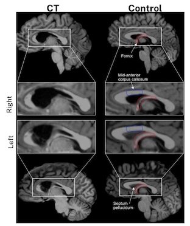

# About Me
Hello there! My name is Jo, and I'm an upcoming graduate from the University of Toronto with a BSc in Psychology

## Education	 			        		
- B.Sc., Psychology | The University of Toronto (_May 2025 (Expected)_)

# Projects
### Gender differences in loneliness in couples and singles

- Prior research has found that women experience unique challenges in relationships compared to men, such as uneven distribution of labour and emotional caretaking (ie. Yan-Liang et al, 2023; Weddel et al., 2022; Steelman, J., 2007)
- Recent discussions online and [in media](https://www.yahoo.com/news/men-carrying-brunt-loneliness-epidemic-122729356.html) have suggested that there is an emerging "male loneliness epidemic", but few studies have investigated this idea
- These ideas inspired me to investigate whether gender differences in loneliness exist in single and partnered people

- I used data from the 2022 National Wellbeing Survey [Dataset](https://www.icpsr.umich.edu/web/ICPSR/studies/38964)
  - (_7594 participants ages 18-64 surveyed via a web-based survey_)
  - (_Survey included 3 questions about participants' loneliness and 1 question about happiness_)
- I tested whether either gender reported feeling significantly lonelier than the other, and compared between singles and those in relationships with an ANOVA
  - [data analysis code](https://github.com/jordanstarenky/PSY329-Project/blob/main/Project.md)

- Interestingly, I found that women in relationships reported feeling lonelier and less happy than men in relationships
  - (_This gender difference did not exist in single people_)
- I suggest that this difference might be due to gender roles and expectations of women within relationships, and these findings also challenge the idea that there is a (_male_) loneliness epidemic
- Broadly, these findings can be used to encourage more research into understanding the challenges and stressors that women face in relationships so that we can understand how to better support them

### Drawing promotes memory retention in a patient with sleep-related anterograde amnesia

Matorina, N., Meade, M. E., Starenky, J., & Barense, M. D. (2024). Drawing promotes memory retention in a patient with sleep-related anterograde amnesia. Memory & Cognition. [doi](https://doi.org/10.3758/s13421-024-01613-9)

- Previous work in patient with probable dementia showed a benefit to using drawing as an encoding mechanism, possibly due to the preservation of visual processing regions
- Patient CT (aged 19 years)presented with a tumour directly above both fornices and invading the right fornix
- Previous work in the lab showed that CT had mild memory impairments during periods of wake and profound impairments following periods of sleep

- CT and age-matched controls completed an encoding task wherein they were presented with a series of words and instructed to either draw or write each one. After a 12-hour interval of either sleep or wake, the participants completed a recognition test wherein they were presented with a cue or lure and asked to make a “remember”, “know”, or “new” response

- We found that drawing is a powerful encoding tool and supports memory in a patient with sleep-dependent amnesia
- We also found that CT showed evidence of memory for drawn words after sleep, but not for written words, further suggesting that CT's memory benefitted from drawing. More broadly, our results suggest that drawing may facilitate memory retention by engaging visual processing regions of the brain, and that these regions may be less susceptible to transformation during sleep.

### Neural activity decreases in synchronicity over shared learning experiences

- Knowledge and expertise can affect neural activity, and shared experiences can result in shared neural patterns among individuals
- Here, we investigated whether an increase in expertise results in increased synchronization in neural activity in higher-order areas
- Previously obtained data from participants who watched six seasons of a TV show during functional MRI was analysed to find inter-subject correlation within higher-order cortico-hippocampal networks associated with prior knowledge
  
- Contrary to our predictions, a two-sample permutation t-test yielded a (_decrease_) in inter-subject correlation within the anterior temporal (ATN) and language (LANG) networks
- In particular, the LANG network comprises the superior temporal gyrus and the IFG, and the two networks combined form the semantic language network
- This network modulates semantic conceptual representations that overlap with communication particular to our domain knowledge, marking language as a bridge into other realms of cognition. 
It is possible that neural activity decreased in similarity over an increase in domain knowledge because individuals had an increased ability to incorporate personal factors.

